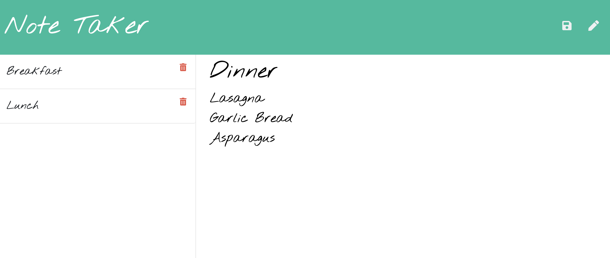

# Unit 11 Express Homework

## Note Taker

## Description
This is an application that can be used to write, save, and delete notes. This application usea an express backend and saves and retrieves note data from a JSON file.

## Business Context
For users that need to keep track of a lot of information, it's easy to forget or be unable to recall something important. Being able to take persistent notes allows users to have written information available when needed.

## Features
* This application's only dependancy is Express
* Creates, updates and can delete within a list of notes in the ul portion of the html

## Challenges
* Crash course in linking css and multiple js files when hosted on a server (app.use)
* Issues with MIME type on the css file
* Struggled to get the list to update when an item was deleted

## To View This
You can visit https://86hemphill.github.io/Note-Taker/

### Licensing
The code in this project is licensed under MIT license.

Copyright (C) 2020 Logan Hemphill

Permission is hereby granted, free of charge, to any person obtaining a copy of
this software and associated documentation files (the "Software"), to deal in
the Software without restriction, including without limitation the rights to
use, copy, modify, merge, publish, distribute, sublicense, and/or sell copies
of the Software, and to permit persons to whom the Software is furnished to do
so, subject to the following conditions:

The above copyright notice and this permission notice shall be included in all
copies or substantial portions of the Software.

THE SOFTWARE IS PROVIDED "AS IS", WITHOUT WARRANTY OF ANY KIND, EXPRESS OR
IMPLIED, INCLUDING BUT NOT LIMITED TO THE WARRANTIES OF MERCHANTABILITY,
FITNESS FOR A PARTICULAR PURPOSE AND NONINFRINGEMENT. IN NO EVENT SHALL THE
AUTHORS OR COPYRIGHT HOLDERS BE LIABLE FOR ANY CLAIM, DAMAGES OR OTHER
LIABILITY, WHETHER IN AN ACTION OF CONTRACT, TORT OR OTHERWISE, ARISING FROM,
OUT OF OR IN CONNECTION WITH THE SOFTWARE OR THE USE OR OTHER DEALINGS IN THE
SOFTWARE.